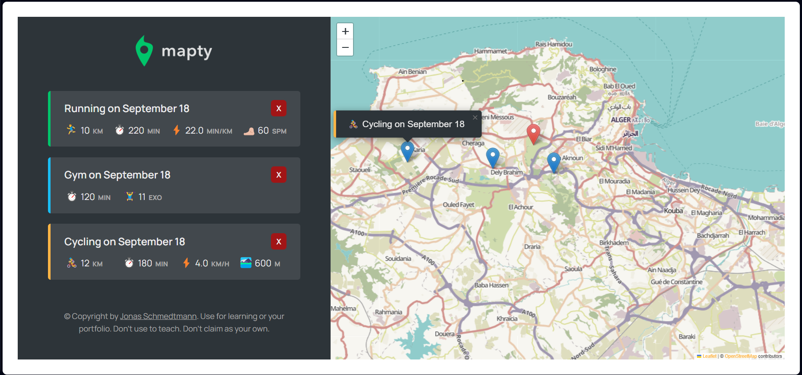
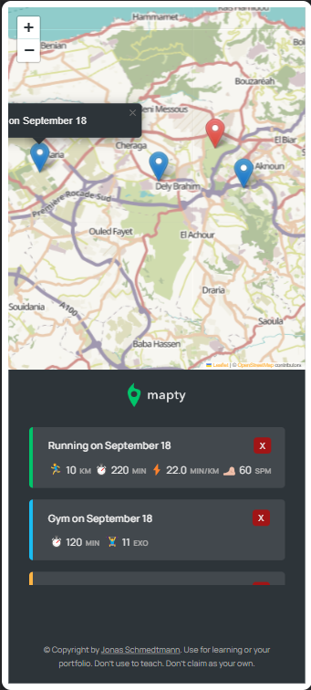

# Mapty
https://mohamedmouloudj.github.io/Mapty/

This is my firs application using OOP in Javascript.
the idea of this application is to log user's workout with details, and show the place where he did the workouts on the map.

I built this project with the instructor ***Jonas Schmedtmann***, and I added some features.

## Preview
### Desktop

### Mobile

## Features
- Saved data of user's workout
- Listed workouts log
- Informations about the workout with dates
- Easy track of places of the workouts
- Responsive design

## Technologies I used
- HTML & CSS
- Javscript
- OOP
- Leaflet library
- Locale storage

## Contact 
Feel free to contact me if you have idea of project you want to realise, you can reach me at mouloudy656565@gmail.com .
